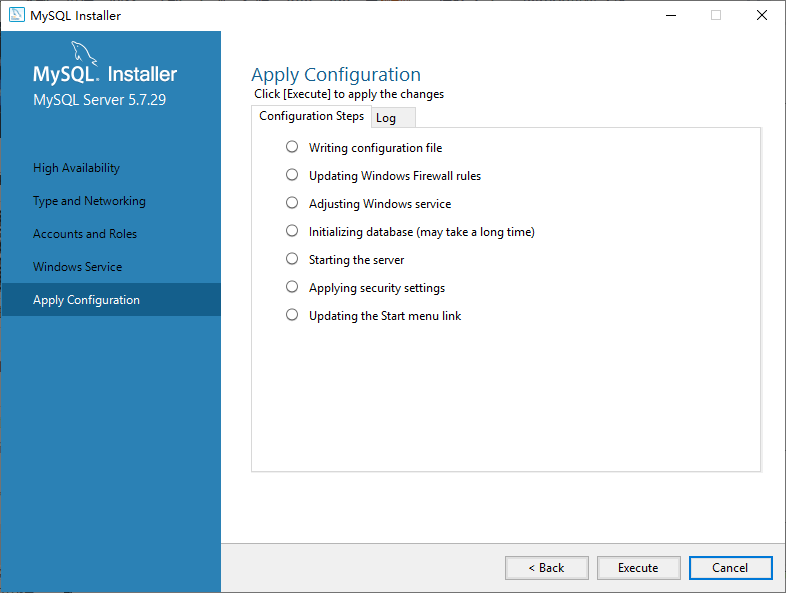
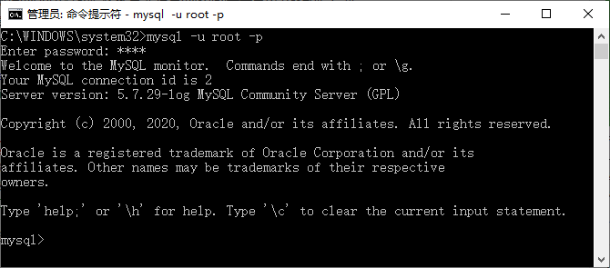

# 数据库安装和配置
##  1、Windows系统安装配置
    MySQL 允许在多种平台上运行，但由于平台的不同，安装方法也有所差异。本节主要介绍如何在 Windows 平台上安装配置 MySQL。
    
    Windows 平台下提供两种安装 MySQL 的方式：
    
    * MySQL 图形化安装（.msi 安装文件）。
    * 免安装版（.zip 压缩文件）。
    
    用户使用图形化安装包安装配置 MySQL 的步骤如下：

### 步骤 1)：
    双击下载的 MySQL 安装文件，进入 MySQL 安装界面，首先进入“License Agreement（用户许可证协议）”窗口，选中“I accept the license terms（我接受系统协议）”复选框，单击“Next（下一步）”按钮即可。
    
    
    注意：图中列出了 5 种安装类型，分别是：
    
    * Developer Default：默认安装类型；
    * Server only：仅作为服务；
    * Client only：仅作为客户端；
    * Full：完全安装；
    * Custom：自定义安装类型。

### 步骤 2)：
    根据所选择的安装类型安装 Windows 系统框架（framework），单击 Execute 按钮，安装程序会自动完成框架的安装，如图所示。
    

###     步骤 3)：
    当弹出安装程序窗口时，勾选“我同意许可条款和条件”复选框，然后单击“安装”按钮，如图所示。
    

###     步骤 4)：
    弹出“设置成功”的界面，表示该框架已经安装完成，单击“关闭”按钮即可。所有的框架安装均可参考本操作，如图所示。
    

###     步骤 5)：
    进入服务器名称窗口设置服务器名称，这里无特殊需要也不建议修改。继续单击 Next 按钮，如图所示。
    

###     步骤 6)：
    打开确认设置服务器窗口，点击 Execute 按钮完成 MySQL 的各项配置，如图所示。
    
    注意：有些安装的时候会在“Starting the server”位置卡住不动，然后提示错误无法安装，可能是你下载的数据库版本过高与系统不匹配，可以降低数据库版本或者升级系统版本。
    都检测通过后，继续点击 Finish、Next 安装就可以配置完成了。

###     步骤 7)：
    最后打开 Windows 任务管理器对话框，可以看到 MySQL 服务进程 mysqld.exe 已经启动了，如图所示。
    

###     步骤 8)：

    在桌面上右击“此电脑”→“属性”命令，如图所示。
    

###     步骤 9)：
    打开“控制面板”窗口，选择“高级系统设置”，如图所示。
    

###     步骤 10)：
    弹出“系统属性”对话框，单击“环境变量”按钮，如图所示。
    

###     步骤 11)：
    弹出“环境变量”对话框，在“USER 的用户变量”列表框中选择 Path 变量，单击“编辑”按钮，如图所示。
    

###     步骤 12)：
    弹出“编辑系统变量”对话框，将 MySQL 应用程序的 bin 目录（C：\Program Files\MySQL\MySQL Server 5.7\bin）添加到变量值中，用分号（必须是英文的分号）将其他路径分隔开，如图所示。
    

###     步骤 13)：
    添加完成后，单击“确定”按钮，这样就完成配置 Path 变量的操作，然后就可以直接输入 MySQL 命令来登录数据库了，如图所示。
    

* * *

##  2、linux系统安装配置